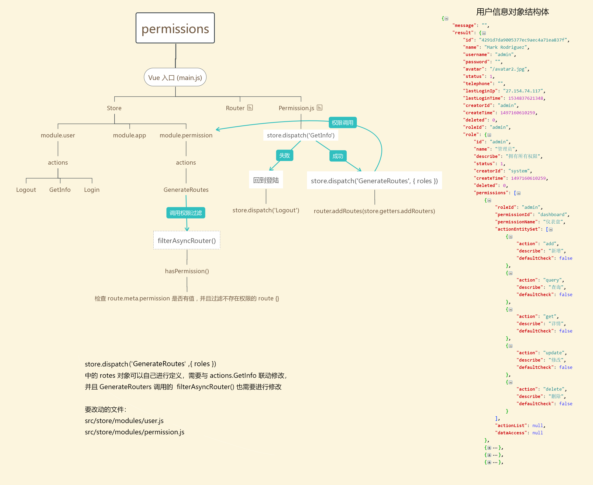

# 路由管理器

## 配置文件路径

[路由地图](./router-map.js)

## 格式和说明

```js
/**
 * 路由配置说明：
 * 建议：sider menu 请不要超过三级菜单，若超过三级菜单，则应该设计为顶部主菜单 配合左侧次级菜单
 *
 **/
{
  name: 'router-name',
  path: '/path',
  component: component,
  redirect: noredirect,
  hidden: true,
  meta: {
    title: 'title',
    icon: 'a-icon',
    keepAlive: true,
    hiddenHeaderContent: true,
  }
}
```

`{ Route }` 对象

| params             | type    | default | intro                                                |
| ------------------ | ------- | ------- | ---------------------------------------------------- |
| name               | string  |         | 路由名称，必须设置，且不能重名                       |
| path               | string  |         | 路由路径，url 地址                                   |
| component          | vm      |         | 路由组件                                             |
| redirect           | string  |         | 重定向地址，访问这个路由时，自定进行重定向           |
| hidden             | boolean | false   | 控制路由是否显示在 sidebar                           |
| meta               | object  | {}      | 路由元信息（路由附带扩展信息）                       |
| hideChildrenInMenu | boolean |         | 强制菜单显示为 Item 而不是 SubItem(配合 meta.hidden) |

`{ Meta }` 路由元信息对象

| params              | type         | default | intro                                                                                                                                                           |
| ------------------- | ------------ | ------- | --------------------------------------------------------------------------------------------------------------------------------------------------------------- |
| title               | string       |         | 路由标题, 用于显示面包屑, 页面标题 \*推荐设置                                                                                                                   |
| icon                | [string,svg] |         | 路由在 menu 上显示的图标                                                                                                                                        |
| keepAlive           | boolean      | false   | 缓存该路由                                                                                                                                                      |
| hidden              | boolean      | false   | 配合`alwaysShow`使用，用于隐藏菜单时，提供递归到父菜单显示 选中菜单项*（可参考 个人页 配置方式）*                                                               |
| hiddenHeaderContent | boolean      | false   | \*特殊 隐藏 [PageHeader](https://github.com/sendya/ant-design-pro-vue/blob/master/src/components/layout/PageHeader.vue#L14) 组件中的页面带的 面包屑和页面标题栏 |
| permission          | array        | []      | 与项目提供的权限拦截匹配的权限，如果不匹配，则会被禁止访问该路由页面                                                                                            |

## 路由例子

```es6
const routerMap = [
  {
    name: 'index',
    path: '/',
    component: BasicLayout,
    redirect: '/dashboard/workplace',
    meta: { title: '首页' },
    children: [
      {
        name: 'dashboard',
        path: '/dashboard',
        component: Layout,
        redirect: '/dashboard/workplace',
        meta: {title: '仪表盘', icon: 'dashboard', permission: ['dashboard']},
        children: [
          {
            name: 'workplace',
            path: '/dashboard/workplace',
            component: () => import('@/views/dashboard/workplace'),
            meta: {title: '工作台', permission: ['dashboard']}
          },

          ...
        ]
      },

      ...
    ]
  },

  ...
]
```

> 1.  请注意 `component: () => import('..')` 方式引入路由的页面组件为 懒加载模式。具体可以看 [Vue 官方文档](https://router.vuejs.org/zh/guide/advanced/lazy-loading.html)
> 2.  增加新的路由应该增加在 '/' (index) 路由的 `children` 内
> 3.  `permission` 可以进行自定义修改，只需要对这个模块进行自定义修改即可 [src/store/modules/permission.js#L10](https://github.com/sendya/ant-design-pro-vue/blob/master/src/store/modules/permission.js#L10)

附权限路由结构：
