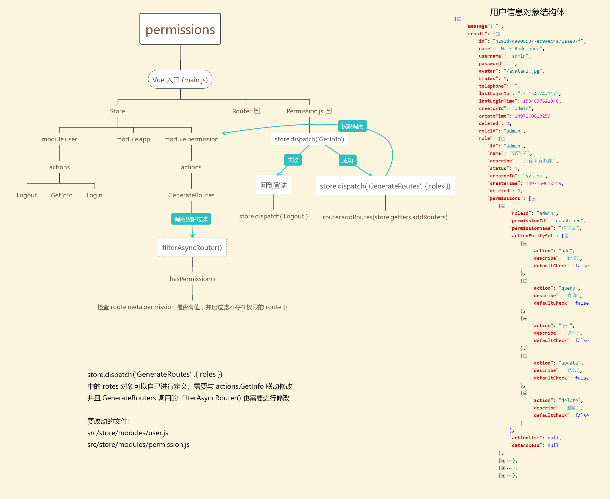

# 状态管理器

## 结构和说明

`{ state }` 状态数据库
`{ getters }` 取出状态
`{ mutations }` 修改状态
`{ mutation-types }` 使用常量替代 Mutation 事件类型
`{ actions }` 异步提交 mutation
`{ modules }` 模块化状态数据库

> `注意`如果不同模块下有`命名冲突`，需要加上 namespaced:true，然后调用时需要加入所属的模块名

```es6
/**
 * main.js
 *
 **/
const store = new Vuex.Store({
  state,
  getters,
  mutations,
  actions,

  modules: {
    app,
    user,
    permission
  }
})
```

`{ app }` 项目配置

| params         | type    | default    | intro                                                                  |
| -------------- | ------- | ---------- | ---------------------------------------------------------------------- |
| color          | string  | null       | 主题颜色                                                               |
| theme          | string  | 'dark'     | 菜单风格：dark 暗色模式、 light 亮色模式                               |
| layout         | string  | 'sidemenu' | 整体布局方式： sidemenu 侧边栏导航模式、 topmenu 顶部栏导航模式        |
| contentWidth   | string  | 'Fixed'    | 内容区布局（topmenu 顶部栏导航模式下才有效）： Fixed 固定、 Fluid 流式 |
| fixedHeader    | boolean | false      | 头部栏 固定                                                            |
| autoHideHeader | boolean | false      | 头部栏 向下滚动时，隐藏                                                |
| sidebar        | boolean | true       | 左侧菜单栏 显示/隐藏                                                   |
| fixSiderbar    | boolean | false      | 左侧菜单栏 固定                                                        |
| weak           | boolean | false      | 色盲模式                                                               |
| multiTab       | boolean | true       | 多标签模式                                                             |
| device         | string  | 'desktop'  | 设备：desktop、tablet、mobile                                          |

`{ user }` 用户配置

| params  | type   | default | intro    |
| ------- | ------ | ------- | -------- |
| token   | string | ''      | 登录标识 |
| name    | string | ''      | 用户昵称 |
| welcome | string | ''      | 欢迎语   |
| avatar  | string | ''      | 用户头像 |
| roles   | array  | []      | 用户权限 |
| info    | object | {}      | 详情信息 |

`{ permission }` 权限配置

| params     | type  | default | intro                       |
| ---------- | ----- | ------- | --------------------------- |
| routers    | array | []      | 根据权限-可访问路由表       |
| addRouters | array | []      | 根据权限-菜单栏可显示路由表 |

附权限路由结构：

## 映射功能

```es6
/**
 * Vue组件内部使用：
 *
 **/
import { mapState, mapGetters, mapMutations, mapActions } from 'vuex'
export default {
  computed: {
    ...mapState()
    ...mapGetters()
  },

  methods: {
    ...mapMutations(),
    ...mapActions()
  }
}
```
